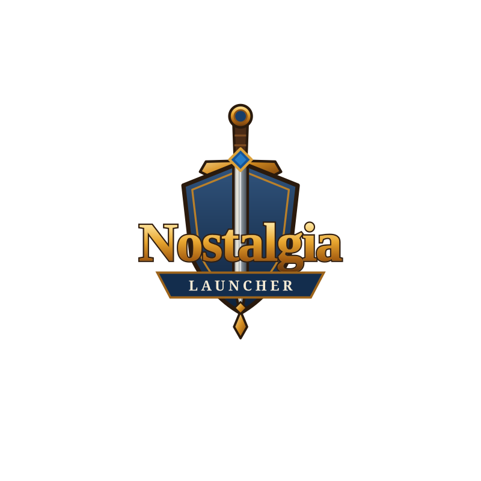

<p align="center">
  
</p>

# Nostalgia Launcher

Nostalgia Launcher is a desktop application that helps you verify, update,
and configure a game installation — for example a Vanilla WoW (1.12.1)
client — against a **configuration that you supply yourself**. It is a local
tool: it does not include, host, or distribute any game files, and it does
not maintain or recommend any server directory.

> **What this project is not.** Nostalgia Launcher does not ship World of
> Warcraft game files, Blizzard artwork, or private-server lists. It does not
> operate game servers and does not point you at any particular community.
> You bring the installation and the configuration; the launcher applies it.

## What it does

- Verifies a selected game folder via BitTorrent piece hashes against a
  snapshot **your configuration advertises** (`server.download.torrent`).
  Incremental updates are torrent-only. The folder must be confirmed once in
  Settings — the launcher never downloads anywhere until you choose where,
  and the active folder stays visible in the footer.
- For a first-time install (no playable client), downloads a single archive
  over HTTPS (`server.download.http.fallback` + `server.download.content.type`)
  and extracts it. There is no per-file HTTP update path.
- Installs and updates mods and addons from catalogs **your configuration
  points at** (Git hosts, validated by host allowlist).
- Runs **multiple isolated profiles** — one per server/community, each with
  its own server config, game-folder confirmation, mod records and caches.
  Switch from the header selector (restarts into that profile); create,
  duplicate, rename and delete them in Settings → PROFILES. Launching a
  second copy of the same profile just focuses the running window;
  different profiles may run side by side.
- Applies common graphics, camera, sound, and gameplay preferences via
  `Config.wtf`.
- Shows news and announcements **only if your configuration provides a
  feed**.

The launcher starts from a **generic capability**, not a specific game
client: select a folder, import a configuration, review it, verify it, apply
it.

## Trust boundary

```
Nostalgia Launcher (local tool)
        │
        ▼
  a game installation you already own / selected
        │
        ▼
  a configuration you explicitly import
  (local .json file, or an https URL you type)
        │
        ▼
   optional, validated content/update sources
  (torrent snapshot or fallback archive, catalogs, news — all named by the config)
```

The core repository does not know which servers or communities exist. A
configuration is an untrusted input: it is validated (schema, HTTPS-only
URLs, host allowlist, path-traversal guards) before anything is downloaded
or written.

## Getting the app

Download the latest release from:

<https://github.com/Ourouk/nostalgia-launcher/releases/latest>

Each release includes per-platform packages plus a matching `.sha256`
checksum file. Verify the checksum when downloading from an untrusted or
mirrored source.

## First launch — import a configuration

The launcher has **no built-in server list**. On first launch it asks you to
import a launcher configuration:

- **Local file** — choose a `nostalgia_launcher.json` file supplied by your
  community.
- **URL** — paste an `https://` configuration URL your community provides.

Before anything is saved, the launcher shows a **summary** of the
configuration: the server name, the base URL, every host it will contact,
and which features are enabled (client updates, BitTorrent, news, mod/addon
catalogs, mirrors). Only accept a configuration from a source you trust.

You can also supply a configuration explicitly:

```text
NostalgiaLauncher --launcher-config PATH
```

(URL import lives in the first-launch wizard and in Settings; the flag
itself takes a local file only. A path that is missing or invalid is a hard
error.)

> Naming: the installed console script is `nostalgia-launcher`; the frozen
> release binaries are called `NostalgiaLauncher(.exe/.AppImage)`. The
> examples use the packaged names.

## Debugging from the command line

Every run appends its diagnostics to a session log next to the config
(`~/.nostalgia-launcher/launcher.log` on Linux,
`%APPDATA%\NostalgiaLauncher\launcher.log` on Windows,
`~/Library/Application Support/NostalgiaLauncher/launcher.log` on macOS).
When it outgrows 512 KiB it rotates to `launcher.log.old`. Two flags read
and surface it:

```text
NostalgiaLauncher --print-log        # whole retained log (old + current)
NostalgiaLauncher --print-log 50     # just the last 50 lines
NostalgiaLauncher --show-log         # launch with the Session log window open
```

`--print-log` prints and exits — it never starts the graphical launcher.
The **Settings → Troubleshooting → Show logs** row toggles the same Session
log window during a session. Output of the launched game is captured too:
on Linux the umu-launcher/Wine messages (`[umu] …`), on Windows WoW.exe's
console output (`[game] …`) — so a crash report contains what the client
itself printed.

## Using the launcher

### Verification and updates

The launcher verifies a selected folder against a BitTorrent snapshot
**your configuration points at** (`torrent_url` and/or `magnet`) by hashing
local files against the snapshot's piece hashes. Only missing/changed pieces
are fetched (peer data that fails piece hashes is rejected). For a first-time
install with no playable client, it fetches a single `fallback` archive
(`client.zip`/`rar` or `folder`) over HTTPS and extracts it per
`content.type`. Incremental updates never use per-file HTTP.

### Mods and addons

The **MODS** and **ADDONS** tabs list the catalogs named by your
configuration. There is no universal built-in list — what you see depends
entirely on the configuration you imported.

### Tweaks

The **TWEAKS** tab writes preferences to `Config.wtf` only. The launcher
never binary-patches game executables; runtime client fixes (where used)
are left to loader mods installed by your configuration.

### News

The **NEWS** tab shows announcements **only if your configuration provides
a news feed**. With no feed configured, the tab is empty.

### Linux

On Linux the play action runs the Windows client through
[umu-launcher](https://github.com/Open-Wine-Components/umu-launcher) (the
Unified Launcher for Windows Games). The play button appears only when
`umu-run` is detected.

## Security and privacy

- Downloads use HTTPS with host restrictions derived from your
  configuration; redirects stay HTTPS-only; TLS is verified (≥ TLS 1.2).
- Metadata responses (torrent, catalogs, news, logos) are size-capped.
- Extracted archives are guarded against path traversal; installed files
  are confined to the selected game folder.
- The launcher retrieves content only from the URLs your configuration
  names. Review those URLs and hosts before using the launcher, and only
  import configurations from sources you trust.
- No telemetry or tracking is included.

## Data files

Settings, installation records, and caches live in your user profile:
Linux `~/.nostalgia-launcher`, Windows `%APPDATA%\NostalgiaLauncher`, macOS
`~/Library/Application Support/NostalgiaLauncher`. Deleting the settings
directory resets the launcher.

## Legal notices

World of Warcraft and Blizzard are trademarks or registered trademarks of
Blizzard Entertainment. Nostalgia Launcher is independent and is **not
affiliated with, endorsed by, or sponsored by Blizzard Entertainment**.

Nostalgia Launcher is a local configuration and update tool. It does not
create, host, own, or redistribute game files, mods, addons, or patches —
those are provided by the configuration you import and by the third parties
that operate the endpoints it names.

You are responsible for ensuring that your use of game software and of any
third-party services complies with applicable laws, licenses, and the terms
of those third parties. A technical design can reduce legal exposure, but it
does not guarantee legal compliance; compatibility with private servers may
still violate contractual terms or raise legal issues depending on your
jurisdiction.

## Attribution and license

Licensed under the Apache License, Version 2.0 — see [LICENSE](LICENSE).

This project was inspired by Octo Updater by rebasedkon
(<https://github.com/rebasedkon/octo-updater>).

Nostalgia Launcher is maintained by Andrea Spelgatti
(<spelgattiandrea@ourouk.be>).
