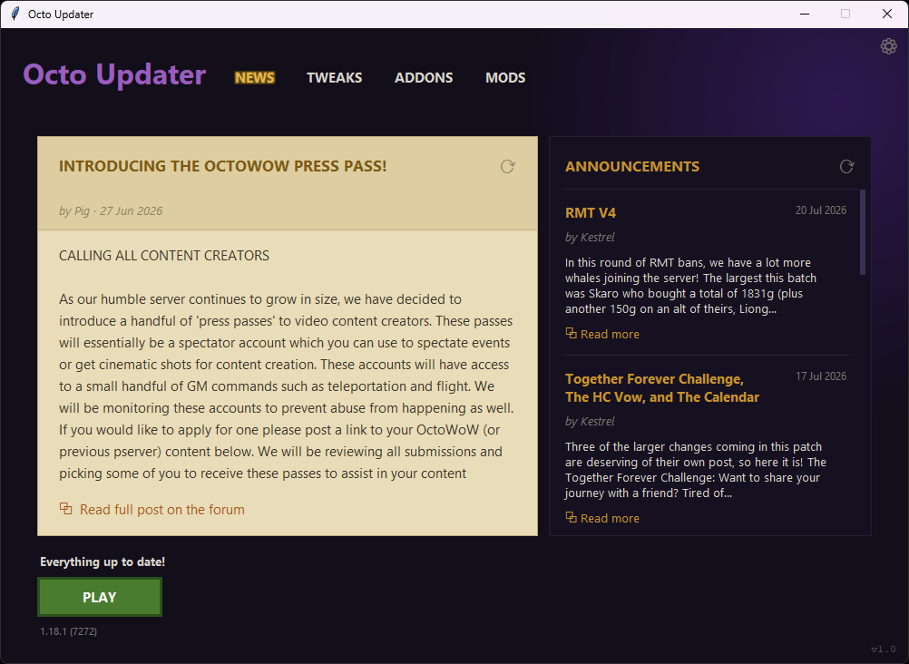

# Octo Updater

A standalone desktop updater and mod manager for the **OctoWoW** client.
It updates and patches the game client, manages community **mods** and **addons**,
applies client **tweaks**, and shows server **news**.



The interface is a modern **PySide6/Qt** implementation. The backend is
selected at startup via `OCTO_UI_BACKEND` (see
[Backend selection](#backend-selection)).

---

## Features

### 🔄 Client updates
- Verifies the local client against the server manifest (per-file SHA-1) and
  downloads only what changed.
- Resumable downloads (HTTP range), live speed/size readout, automatic retry
  with backoff, and integrity re-check after each file.
- Reads and displays the installed client version straight from `WoW.exe`.

### 🧩 Mods
Curated set of client modifications, installed from their official GitHub /
Codeberg releases and registered in `dlls.txt`:

| Mod | Purpose |
|-----|---------|
| VanillaFixes | Eliminates stutter and animation lag (also the DLL loader; required by other mods) |
| ClassicAPI | Adds later-version Lua API calls to the client; required by some addons |
| DXVK | Vulkan-based rendering for better performance |
| nampower | Reduces input lag on higher latency |
| SuperWoW | Backported client API features; required by some addons |
| transmogfix | Fixes transmog-related frame drops |
| UnitXP_SP3 | Adds modern quality-of-life features and improvements |
| VanillaHelpers | Raises the max supported texture resolution and improves memory allocation |
| VanillaMultiMonitorFix | Fixes multi-monitor resolution issues (optional) |

- Essential mods (★) auto-install on a fresh game folder.
- Per-mod **update** / **retry** actions and an update-count badge on the tab.

### 🎛️ Tweaks
Patches `WoW.exe` and writes `Config.wtf` for common quality-of-life settings:
Field of View, render distance, nameplate range, camera distance, ground
clutter distance, always-auto-loot, background sounds, and more. Invalid values
are clamped; Apply/Reset appear only when something changed.

### 📦 Addons
- Installs addons directly from Git hosts (**GitHub, GitLab, Gitea, Codeberg**)
  by downloading the repo archive pinned to a commit SHA — no Git client needed.
- Curated **recommended** list (★) plus everything from the server catalog.
- **Add custom git addon** dialog for any allowed host.
- Update detection by comparing the installed commit against the latest,
  one-click **Update** / **Update all**, and an update-count badge.
- pfUI gets a curated **"Default"** profile injected and added to its firstrun
  picker after each install/update.

### 📰 News
Pulls the live announcements feed and the featured forum post.

### ⚙️ Settings
Change the game folder, check mirror status, verify game files, view session
logs, add the game folder to Defender exclusions, and adjust general options.

### 🔒 Security & robustness
- Hardened TLS (system trust store, hostname check, TLS 1.2+ floor).
- HTTPS-only with per-host allowlists for all downloads; redirects stay HTTPS.
- Atomic config writes (temp + rename) with a lock — safe against concurrent
  workers and interrupted saves.
- Path-traversal-safe archive extraction.
- Automatic self-update check against this repo's GitHub releases (once a day).

---

## Requirements

- **Python 3.10+** — only if running from source.
- **PySide6** (≥ 6.6) — runtime dependency for the Qt interface, which is
  the default backend (`uv sync` installs it, see [Development](#development)).
- **certifi** (optional) — bundles an up-to-date CA store for more robust TLS
  verification on machines with an out-of-date root store (otherwise the
  system trust store is used).
- The prebuilt `OctoUpdater.exe` needs nothing installed.

### Platform support

- **Windows** — full support: client updates, mods, addons, tweaks (including
  the `WoW.exe` binary patch), game launching, and Defender exclusions.
- **Linux / macOS** — the generic features work: client file updates, mods,
  addons, news, configuration, and `Config.wtf` tweaks. Actions tied to the
  Windows client (game launch, binary `WoW.exe` patching, Defender exclusions)
  are disabled automatically. The Qt backend runs on either (on Linux it needs
  the system Qt libraries — see [Building](#building)).

### Configuration location

Where the config and hash-cache files live depends on the platform (see
`platform_support.config_dir()` / `cache_dir()`):

| Platform | Config & cache location |
|----------|-------------------------|
| Windows | Next to the executable |
| Linux | `$XDG_CONFIG_HOME/octo-updater` and `$XDG_CACHE_HOME/octo-updater` (defaults: `~/.config/octo-updater` and `~/.cache/octo-updater`) |
| macOS | `~/Library/Application Support/OctoUpdater` and `~/Library/Caches/OctoUpdater` |

All are safe to delete — they're recreated on next run (deleting the config
re-runs first-time setup).

### Display scaling & resizing

The **Qt** UI relies on Qt's native high-DPI handling: `qt_app.create_qt_app`
enables per-monitor scaling and a PassThrough scale-factor rounding policy
before the `QApplication` exists, so fractional display scales (e.g. 125%)
are preserved. Qt renders in *logical* pixels and applies the device-pixel
ratio at compositor time, so the same window and minimum sizes hold at
100%–200%. For troubleshooting you can override the detected scale with
`QT_SCALE_FACTOR` (and `QT_ENABLE_HIGHDPI_SCALING`). The layout math lives in
`ui_metrics.py` and is covered by unit tests plus the offscreen
`tests/test_qt_display.py` checks; the real-display QA matrix lives in
[docs/DISPLAY_TEST_MATRIX.md](docs/DISPLAY_TEST_MATRIX.md).

---

## Usage

### Prebuilt executable
Download `OctoUpdater.exe` from the [latest release](../../releases/latest) and
run it. Point the **Game folder** (Settings ⚙) at your OctoWoW client folder —
or let the default create one next to the executable — then click **UPDATE**,
and **PLAY** when it finishes.

### From source
```bash
python octo_updater.py
```

The updater writes two JSON files — see
[Configuration location](#configuration-location) for where each platform
keeps them:

| File | Purpose |
|------|---------|
| `octo_updater_config.json` | Settings, mod/addon install records, caches |
| `octo_updater_hash_cache.json` | Per-file SHA-1 cache to speed up verifies |

Both are safe to delete — they'll be recreated (deleting the config re-runs
first-time setup).

### Backend selection

The GUI backend is chosen at startup via the `OCTO_UI_BACKEND` environment
variable (`qt` is the current default):

| Value | Backend |
|-------|---------|
| `qt` / `pyside6` | PySide6/Qt interface (`qt_app.py`) — default |

```bash
uv run python octo_updater.py                       # Qt (PySide6, default)
```

- An unknown value prints `Unknown OCTO_UI_BACKEND: <value>` and exits.
- If the Qt toolkit can't be imported, the entry point prints *"Octo Updater
  needs PySide6 (Qt) to run. Install it with `uv sync` or `pip install
  PySide6`."* and exits.
- Starting on a machine without a graphical display prints
  *"A graphical display (X11/Wayland) is required."* and exits.

---

## Building

### PyInstaller

Compile a single-file, windowed `OctoUpdater` executable with
[PyInstaller](https://pyinstaller.org/). The build is driven by
`OctoUpdater.spec`, which collects all of PySide6 (plugins + Qt libraries),
lists the app modules as hidden imports (the Qt backend is imported at
runtime from `octo_updater.py`), bundles the `OctoUpdater.ico` icon and
produces a windowed app from the unchanged `octo_updater.py` entry point:

```bash
uv sync --dev                    # installs pyinstaller into the dev environment
uv run pyinstaller --noconfirm --clean OctoUpdater.spec
```

Or, with a plain `pip` environment:

```bash
pip install pyinstaller certifi
pyinstaller OctoUpdater.spec
```

### pyside6-deploy (alternative)

PySide6 ships its own
[deployment tool](https://doc.qt.io/qtforpython-6/deployment/deployment-pyside6-deploy.html)
(`pyside6-deploy`), which drives PyInstaller and handles the Qt plugin /
config collection automatically:

```bash
uv run pyside6-deploy octo_updater.py
```

### AppImage (Linux)

The Linux build is a PyInstaller **directory** bundle wrapped into an
AppImage, so it runs on any modern Linux distribution without installing Qt.
Everything lives in `packaging/linux/`:

| File | Purpose |
|------|---------|
| `OctoUpdater-linux.spec` | PyInstaller onedir spec (no outer onefile — AppImage provides that) |
| `build-appimage.sh` | Full build: PyInstaller → AppDir assembly → `linuxdeploy` |
| `AppRun` | Launcher script resolved relative to the AppImage mount point |
| `OctoUpdater.desktop` | Desktop entry used by linuxdeploy + for app-menu integration |

Prerequisites: `uv`, ImageMagick (`magick`), and a
[`linuxdeploy`](https://github.com/linuxdeploy/linuxdeploy) AppImage matching
your architecture (set `LINUXDEPLOY=/path/to/linuxdeploy-x86_64.AppImage` if
it isn't on `PATH`).

```bash
uv sync --dev
./packaging/linux/build-appimage.sh        # → dist/OctoUpdater-$(uname -m).AppImage
```

Build on (or inside a container of) the oldest distribution you want to
support — AppImages do not solve glibc compatibility. Test both session
types:

```bash
QT_QPA_PLATFORM=xcb     ./dist/OctoUpdater-x86_64.AppImage
QT_QPA_PLATFORM=wayland ./dist/OctoUpdater-x86_64.AppImage
```

### Notes

- Installing `certifi` before building bundles an up-to-date CA certificate
  set into the executable, so TLS verification works even on machines whose
  Windows root store is stale.
- **Linux runtime dependencies** — the Qt backend needs the system Qt
  libraries. On Debian/Ubuntu install `libegl1 libxcb-cursor0
  libxkbcommon-x11-0` plus the xcb platform-plugin dependencies (e.g.
  `libxcb-icccm4 libxcb-keysyms1 libxcb-image0 libxcb-render-util0
  libxcb-shape0 libxcb-xinerama0`). Both X11 and Wayland sessions are
  supported.

---

## Development

The codebase is split into focused modules. The only third-party runtime
dependency is `PySide6` for the Qt backend; everything else is the standard
library.

Architecture: the business logic lives in **toolkit-agnostic controllers**
that publish their results as dataclass *state* (`ui_state.py`) and *events*
on a thread-safe dispatcher (`ui_events.py`). The Qt side (`qt_bridge.py`)
converts the events into Qt signals on the main thread.

| Module | Responsibility |
|--------|----------------|
| `octo_updater.py` | Entry point; backend selection via `OCTO_UI_BACKEND` (PyInstaller target) |
| `qt_app.py` | Qt shell: `create_qt_app` (high-DPI policy), `QtOctoUpdaterApp` |
| `qt_main_window.py` | Qt `MainWindow`: header, tabs, footer chrome |
| `qt_bridge.py` | `ControllerHub` / `ControllerBridge`: dispatcher events → Qt signals |
| `qt_theme.py` | Qt palette + QSS stylesheet |
| `qt_news_panel.py` | Qt News panel (featured post + announcements) |
| `qt_tweaks_panel.py` | Qt Tweaks panel |
| `qt_mods_panel.py` | Qt Mods panel |
| `qt_addons_panel.py` | Qt Addons panel |
| `qt_settings_dialog.py` | Qt Settings dialog |
| `qt_log_window.py` | Qt session-log window |
| `qt_custom_addon_dialog.py` | Qt custom git addon dialog |
| `update_controller.py` | Update/verify orchestration + footer readiness (toolkit-agnostic) |
| `news_controller.py` | News-feed fetch + TTL caching (toolkit-agnostic) |
| `mods_controller.py` | Mods panel: latest-version fetch, apply worker, auto-install (toolkit-agnostic) |
| `addons_controller.py` | Addons panel: catalog scan, git install worker, auto-install (toolkit-agnostic) |
| `settings_controller.py` | Settings/game-folder: folder-change reset, AV exclusion, mirror check, toggles (toolkit-agnostic) |
| `tweaks_controller.py` | Tweaks panel logic (toolkit-agnostic) |
| `ui_state.py` | Toolkit-agnostic state dataclasses (Update, News, Mods, Addons, Settings, Tweaks) |
| `ui_events.py` | Thread-safe event dispatcher shared by both backends |
| `client_update.py` | Manifest verification, resumable downloads, patching |
| `mods.py` | Mod registry, release lookup, install/uninstall |
| `addons.py` | Addon catalog, git commit resolution, archive install, pfUI patch |
| `tweaks.py` | Tweak definitions, Config.wtf, WoW.exe patch builder |
| `security_http.py` | TLS context, HTTPS-only enforcement, host allowlists |
| `config_store.py` | Atomic JSON config/hash-cache persistence |
| `filesystem.py` | Hashing, path/archive helpers |
| `helpers.py` | Pure helper functions |
| `self_update.py` | Updater release checks |
| `news.py` | News feed fetching |
| `errors.py` | Human-readable install/update error messages |
| `log_sink.py` | Thread-safe global log channel |
| `platform_support.py` | Platform detection, capabilities, per-OS helpers |
| `ui_metrics.py` | Responsive layout math |
| `constants.py` | Shared constants and filesystem paths |

### Backend status

The **Qt (PySide6)** interface is feature-complete: all panels, dialogs,
footer workflows and the startup schedule are covered by tests. It is the
only backend.

### Testing

Requires `uv`:

```bash
uv sync --dev
uv run pytest            # full suite; the Qt tests run headless (offscreen)
```

- **Qt offscreen tests** — all `tests/test_qt_*.py` run headlessly by default
  (they set `QT_QPA_PLATFORM=offscreen` before importing PySide6), so the
  whole Qt UI is exercised on any host / CI without a display.
- **Real-display checks** — `tests/test_qt_display.py` Part B only runs on a
  real X11/Wayland session when opted in:

  ```bash
  QT_QPA_PLATFORM=xcb RUN_QT_DISPLAY_TESTS=1 \
      uv run pytest tests/test_qt_display.py -k display
  ```

The human QA matrix for Qt display scaling is in
[docs/DISPLAY_TEST_MATRIX.md](docs/DISPLAY_TEST_MATRIX.md).

---

## Support the Developer

If Octo Updater is useful to you, consider supporting its development:

- 💜 [Ko-fi](https://ko-fi.com/rebased)
- ☕ [Buy Me a Coffee](https://buymeacoffee.com/rebased)

---

## License

See [LICENSE](LICENSE).
