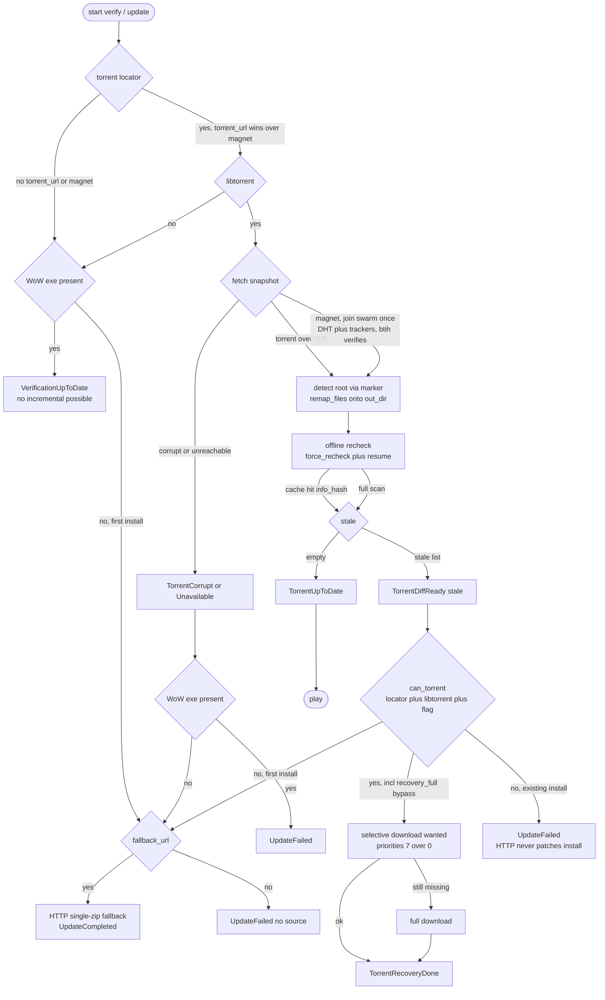

# Client Update Workflow

> Incremental updates are **torrent-only** (piece hashes); HTTP is a
> **single-zip fallback for first install only**. No per-file HTTP
> `traverse()`. Workers post typed dataclass events; the controller
> mutates state; Qt renders via a 50 ms bridge drain.

## 0. Flowchart



## 1. Components

| Piece | File | Role |
|---|---|---|
| `VerifyWorker` / `UpdateWorker` | `services/update/workflow.py` | Background threads; own verify/update logic |
| `TorrentVerifier` / `TorrentDownloader` | `services/update_backend/torrent_update.py` | libtorrent execution only, no policy |
| `DownloadSource` / `_download_source()` | `services/update_backend/sources.py` | Resolve `torrent_url` / `magnet` / `fallback_url` from `server.download` |
| `UpdateController` | `controllers/update.py` | Lifecycle owner; `_on_event` mutates `UpdateState`; `compute_readiness()` drives footer |
| `ControllerBridge` | `ui/qt/bridge.py` | Drains `EventDispatcher` every 50 ms → Qt signals |
| Events | `state/events.py` | Typed dataclasses (`TorrentDiffReady`, `TorrentUpToDate`, `UpdateCompleted`, …) |

```
UI → UpdateController.start_verify()/start_update()
  → worker thread → services → EventDispatcher.post(event)
  → UpdateController._on_event → UpdateState
  → bridge (50 ms) → Qt signals → panels
```

Config: `server.download.torrent.{torrent_url, magnet, update?}` +
`server.download.http.fallback` + `server.download.content.type`
(`folder`/`zip`/`rar`). `.torrent` wins when both URL and magnet are set.
`has_exe` = `WoW.exe` (case-insensitive) or external-launcher exe present.

## 2. Source resolution

`_download_source()` → `DownloadSource(torrent_url, fallback_url, magnet)`:

- `torrent_locator = torrent_url or magnet`.
- `has_torrent() = bool(torrent_url or magnet)`.
- `torrent_update_allowed()`: explicit `torrent.update` wins; else inferred
  as `bool(torrent_url)` — **magnet-only defaults to first-time-only**,
  `torrent_url` defaults to updatable.

## 3. Verify (`VerifyWorker.run`)

1. Post `Verifying…` progress; seed `WTF/Config.wtf` + `realmlist.wtf` if
   `overwrite_config` or missing.
2. No `torrent_locator` or no libtorrent → `_handle_no_torrent()`:
   - existing install (`has_exe`) → `TorrentUnavailable` + `VerificationUpToDate`
     (nothing incremental to do; HTTP never patches an install);
   - first install → `TorrentUnavailable`; UPDATE offers the fallback zip if
     `fallback_url` is set.
3. Else `_torrent_verify(src)`:
   - Fetch `.torrent` over `secure_urlopen` (HTTPS-only, TLS ≥ 1.2,
     host allowlist, 5 MiB cap), cache per-profile at
     `torrents/<info_hash>.torrent`.
   - Magnet: join the swarm **once** to fetch metadata (DHT + embedded
     trackers, throwaway save path, upload-mode when exposed). The `btih`
     authenticates the metadata.
   - Detect root from the unique marker (`WoW.exe`, or
     `server.torrent_root_marker`), `remap_files()` onto `out_dir`
     (double-prefix fix; no-op on test fakes).
   - **Offline session** (`listen_interfaces=""`, DHT/LSD/UPnP/NAT-PMP off),
     `force_recheck()` + `resume()`, stall-guarded wait. File stale iff any
     covering piece missing (`have_piece()` / `sum(status.pieces)`).
   - Cache verdict under `__torrent_validation__`
     (`info_hash`/`content_hash` + `out_dir` + `stale`). Same identity →
     skip re-scan, re-post cached verdict. Changed `info_hash` → discard
     verdict + old resume data.
   - Post `TorrentReachable` then `TorrentUpToDate` / `TorrentDiffReady(stale)`
     or `TorrentCorrupt/Unavailable/Stalled/SessionError/DiskError/VerifyFailed`.
4. `compute_readiness()` stays `disabled / "Verifying…"` until a verdict
   (`torrent_stale/reachable/error`) exists.

## 4. Update (`UpdateWorker.run`)

Inputs: `torrent_wanted` (stale set from verify), `recovery_full` (full-client
button; bypasses the `torrent.update` flag).

- `wanted == set()` → `TorrentUpToDate`, no-op.
- `can_torrent = locator and libtorrent and torrent_update_allowed()`
  (flag skipped when `recovery_full`):
  - ✅ → `TorrentDownloader.download(locator, wanted)`: **online session**,
    per-file priorities `7` = wanted, `0` = rest (selective). `wanted=None`
    means full client. Selective still missing files afterwards → escalate
    to full. No `WoW.exe` after → `UpdateFailed`. Else `remove_wdb`,
    seed configs if missing, cache `stale:[]`, post `TorrentRecoveryDone`.
  - ✅ but throws → existing install: `UpdateFailed`; first install with
    fallback: retry via HTTP below.
  - ❌ + first install + `fallback_url` → `_http_fallback_download()`:
    stream archive to `_fallback.{zip,rar}`, `extract_client_payload()`,
    delete archive, `remove_wdb`, seed configs → `UpdateCompleted(version)`.
  - ❌ + existing install → `UpdateFailed` (**HTTP never patches an install**).
  - ❌ + first install, no fallback → `UpdateFailed("No download source")`.

## 5. Scenario matrix

| torrent_url | magnet (+`update?`) | libtorrent | Install | Verify | Update |
|---|---|---|---|---|---|
| – | – | – | existing | up-to-date (no incremental) | n/a |
| – | – | – | first | unavailable | HTTP zip if configured, else fail |
| ✅/– | –/✅ | ❌ | any | same as no-torrent rows | HTTP zip on first install only |
| ✅ | – | ✅ | any | offline verify → up-to-date / diff | selective / full via torrent |
| – | ✅ (unset/`false`) | ✅ | any | verify (one swarm fetch for metadata) | incremental **refused**; full first-install only |
| – | ✅ (`true`) | ✅ | any | verify | selective / full via torrent |
| ✅ | ✅ | ✅ | any | `.torrent` used, magnet ignored | same |
| corrupt/unreachable | – | ✅ | any | `Corrupt/Unavailable/…` | first install + fallback → HTTP; else fail |

## 6. The `torrent.update` flag

- Magnet-only needs `update:true` to enable incremental at all (default
  `false` = first-install-only, keeping swarm/DHT cost opt-in).
- `torrent_url` + `update:false` freezes incremental pushes while keeping
  first-install (full recovery bypasses the flag) — a server-side kill-switch
  with no client release.
- Note: verify currently ignores the flag (still reports diff); update
  enforces it. So `update:false` surfaces as UPDATE → `UpdateFailed` on
  existing installs.

## 7. Readiness & launch (after update)

`compute_readiness()`: `busy` → `play` (up-to-date) / `update` (stale) /
`disabled` (no source + can't launch) / `terminate` (game running → red
TERMINATE → `umu.kill_game()` SIGTERM → SIGKILL after 2 s). One game process
at a time; `_watch_game` drains child output (`[umu]`/`[game]`, 800-line cap)
into the session log, then posts `GameExited`.

## 8. libtorrent pitfalls (see `bittorrent-notes.md` P1–P10)

P1 remap absolute paths (`remap_files`) — double-prefix fix · P2
`resume()` after `force_recheck()` · P3 `sum(status.pieces)`, never
`count()`/`verified_pieces` · P4 relative-path mangling · P5 info-hash
stable, no resume persistence · P6 offline session flags · P7 stall guard
(60 s / 180 s discovery) · P8 piece-vs-file granularity (advisory) ·
P9 URL ≠ identity · P10 magnet needs networking once, `btih` authenticates.
